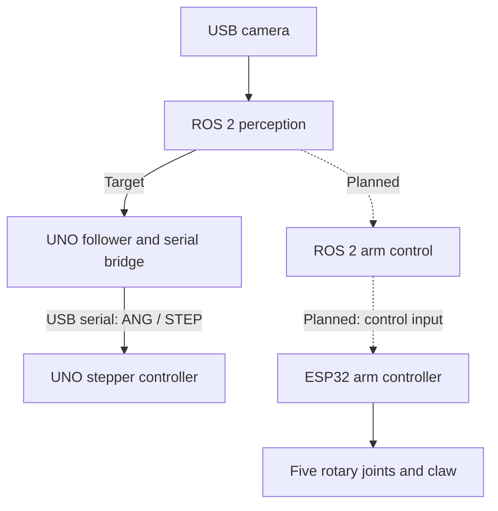

<h1 align="center">ROS2vision</h1>

<p align="center">
  Machine vision and robotic actuation, with Linux and ROS 2 as the host platform.
</p>

<p align="center">
  <a href="ros2_ws/"></a>
  <a href="firmware/arm_controller/"></a>
  <a href="firmware/uno_controller/"></a>
</p>

<p align="center">
  <a href="#architecture">Architecture</a> ·
  <a href="#getting-started">Getting Started</a> ·
  <a href="#roadmap">Roadmap</a> ·
  <a href="#documentation">Documentation</a>
</p>

## Overview

ROS2vision develops a visual feedback system that connects camera perception to physical motion. Linux and ROS 2 provide the host-side foundation; embedded controllers handle actuator output.

The repository currently contains a ROS 2 vision-to-UNO path and a separate ESP32 arm controller. Bringing the arm into the ROS 2 pipeline is the next integration step.

| Area | Current implementation |
| --- | --- |
| ROS 2 perception | USB camera acquisition, image preprocessing, face/color detection, and a structured target message |
| UNO control | Horizontal target following over USB serial, with a ROS 2 bridge and stepper firmware |
| ESP32 arm control | USB serial commands, five rotary joints plus a claw, position and streaming-velocity control, and resolved-rate kinematics |
| ROS 2 arm integration | Planned: hand-target perception, visual-error processing, and ESP32 integration with ROS 2 |

Implementation and hardware validation are tracked separately in [Project Progress](docs/progress.md).

## Architecture



Solid arrows show implemented connections; dashed arrows show planned ROS 2 arm integration. The ESP32 firmware already accepts commands over USB serial. Its future ROS 2 integration method is still open; [communication options](docs/architecture.md#host-to-mcu-communication) distinguish the current path from candidate extensions.

| Directory | Responsibility |
| --- | --- |
| [ros2_ws/](ros2_ws/) | ROS 2 packages for acquisition, recognition, control, interfaces, and system launch |
| [firmware/](firmware/) | Arduino UNO and ESP32 actuator controllers |
| [docs/](docs/) | Architecture, bringup, hardware, interfaces, and project progress |

See [Architecture](docs/architecture.md) for module boundaries and control behavior.

## Getting Started

| Path | Start here |
| --- | --- |
| ROS 2 camera and recognition, then optional UNO following | [ROS 2 bringup](docs/bringup.md#ros-2-host) |
| Standalone ESP32 arm firmware | [ESP32 arm bringup](docs/bringup.md#esp32-arm-controller) |

After completing the ROS 2 build and device setup, start the vision pipeline:

```bash
ros2 launch ros2vision_bringup full_system.launch.py enable_control:=false
```

This starts the camera, preprocessor, and face detector. The [bringup guide](docs/bringup.md) covers adding UNO control, selecting color mode, and opening the debug viewer.

## Roadmap

- Extend recognition with hand-target perception and configurable target selection.
- Add normalized visual-error processing and integrate the ESP32 arm with ROS 2.
- Evaluate Wi-Fi and Bluetooth communication options and micro-ROS integration.
- Integrate launch configuration, diagnostics, and end-to-end arm validation.

The implementation scope and open decisions are maintained in [Project Progress](docs/progress.md#next-milestone-ros-2-arm-integration).

## Documentation

| I want to… | Read |
| --- | --- |
| Understand the system and its responsibilities | [Architecture](docs/architecture.md) |
| Build, flash, and run the existing paths | [Bringup](docs/bringup.md) |
| Check wiring, geometry, and calibration | [Hardware](docs/hardware.md) |
| Look up messages, commands, units, and state semantics | [Interfaces](docs/interfaces.md) |
| Review milestones, validation, and planned work | [Project Progress](docs/progress.md) |
