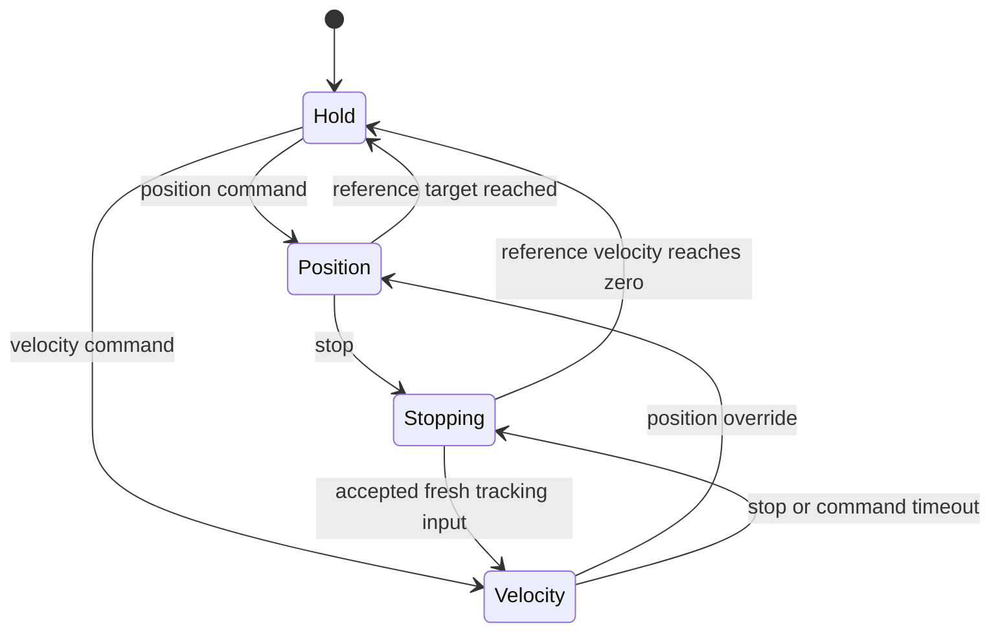

# Architecture

[README](../README.md) / Architecture

This page explains the system's responsibilities and the boundaries between perception, control, and actuator output. Commands and field definitions belong in [Interfaces](interfaces.md); operating steps belong in [Bringup](bringup.md).

## System boundary

Linux and ROS 2 are the intended host platform. The repository currently provides two execution paths:

- **ROS 2 with UNO:** camera acquisition, target detection, horizontal correction, USB serial transport, and stepper output are connected in code.
- **ESP32 arm:** the firmware accepts USB serial commands and generates motion references for five rotary joints and a claw. Its ROS 2 host integration is planned.

The system launch file currently starts the UNO path. ESP32 arm integration is not included. See the overview diagram in the [README](../README.md#architecture).

## Host-to-MCU communication

Communication has two separate choices: the link carrying data, and the way the MCU connects to ROS 2. USB serial, Wi-Fi, and Bluetooth are link options. A host bridge translating a custom protocol and a micro-ROS client communicating through an Agent are integration options.

| Controller / option | Link and integration method | Project status |
| --- | --- | --- |
| UNO | USB serial with the existing ROS 2 bridge and text protocol | Implemented project path |
| ESP32 current path | USB serial with the arm's text commands | Firmware communication available; ROS 2 integration planned |
| ESP32 Wi-Fi with a custom protocol | A host bridge exchanges application commands over TCP or UDP | Candidate; transport and message framing undecided |
| ESP32 Bluetooth | Bluetooth link with a suitable host/firmware interface | Candidate; feasibility and protocol unverified |
| ESP32 micro-ROS | MCU client and a host-side Agent, using serial or Wi-Fi/UDP | Candidate; firmware integration and deployment need evaluation |

The official [micro-ROS component for ESP-IDF](https://github.com/micro-ROS/micro_ros_espidf_component/blob/jazzy/README.md) supports UDP and UART transport. micro-ROS can therefore be evaluated with either a wired or a wireless link. Availability in that component does not establish support in this project's firmware.

### Firmware integration boundary

The current command parser lives in `main`; the motion, kinematics, calibration, and PWM components have separate responsibilities. A proposed integration should pass control input into those components through a defined application interface.

With a custom protocol, a ROS 2 host node would translate messages into MCU commands. With micro-ROS, MCU subscriptions and publishers would exchange structured messages through an Agent. Adding micro-ROS would require changes to application tasks, callback-to-control data handoff, dependencies, and connection handling. Retaining the existing motion and kinematics components is a design goal to validate during integration.

The current USB serial path is the available starting point. Wireless communication and micro-ROS remain candidates; their evaluation is tracked in [Project Progress](progress.md#communication-options-to-evaluate).

## ROS 2 host

| Package | Responsibility | Main entry points |
| --- | --- | --- |
| [camera_vision_pkg](../ros2_ws/src/camera_vision_pkg/) | Acquire raw images and recover the camera process when the device returns | `camera_runner`, `camera_source.launch.py` |
| [recognition_pkg](../ros2_ws/src/recognition_pkg/) | Preprocess images, detect one target, and provide debug images | `image_preprocessor_node`, `target_detector_node`, `tracking_debug_viewer_node` |
| [control_pkg](../ros2_ws/src/control_pkg/) | Convert a target into a horizontal correction and transport it to UNO | `target_follower_node`, `uno_serial_bridge_node` |
| [ros2vision_interfaces](../ros2_ws/src/ros2vision_interfaces/) | Define shared ROS messages | `Target.msg` |
| [ros2vision_bringup](../ros2_ws/src/ros2vision_bringup/) | Compose the existing packages | `full_system.launch.py` |

### Acquisition and perception

The camera runner checks device readiness with `v4l2-ctl`, starts `usb_cam`, and returns to its device-wait loop when that process exits. Acquisition publishes raw images and camera information. Recognition-specific processing stays downstream.

The preprocessor resizes images and optionally preserves aspect ratio with padding. Face mode prepares an image for Haar Cascade detection. Color mode creates an HSV mask with dual red ranges and morphology.

The detector publishes one primary target: the largest face rectangle or the largest qualifying color contour. The current selector has no persistent target identity. The debug viewer displays or records detection images; it is not a tracking algorithm.

### UNO following

The follower consumes horizontal target error and applies smoothing, deadband, hysteresis, and command pacing. It publishes an angle correction, which the serial bridge formats as `ANG` or `STEP`.

The bridge handles connection attempts, startup waiting, a `PING` handshake, transmit pacing, and feedback-based busy handling. The UNO firmware generates the step sequence and maintains a logical step count.

Target loss stops the follower from producing further corrections. It does not send a `STOP` command to cancel an already issued UNO move. See [UNO behavior](interfaces.md#uno-serial-protocol).

## ESP32 arm controller

| Component | Responsibility |
| --- | --- |
| [arm_kinematics](../firmware/arm_controller/components/arm_kinematics/) | Forward pose and damped least-squares resolved-rate conversion from tool velocity to joint velocity |
| [arm_motion](../firmware/arm_controller/components/arm_motion/) | Position/velocity references, measured-time integration, acceleration limits, watchdog handling, and coordinated limiting |
| [arm_joint](../firmware/arm_controller/components/arm_joint/) | Joint calibration, degree-to-pulse mapping, and claw-gap mapping |
| [servo_pwm](../firmware/arm_controller/components/servo_pwm/) | MCPWM output resources, pulse writes, and output enable/disable |
| [main](../firmware/arm_controller/main/main.cpp) | Serial command parsing, Track/Pos ownership, visual-error gains, and solver-side active-set handling |

The application converts normalized visual errors to tool velocities. The kinematics solver returns a coordinated five-joint velocity vector. The motion layer integrates it into position references and sends calibrated pulse commands through the lower layers.

The solver scales the velocity vector together when a joint-speed limit is reached. The application can exclude joints already at their limits and solve again. The motion layer also scales a streaming update to fit the remaining joint travel.

### Motion and ownership

The rotary reference generator has four modes:

This diagram covers the normal rotary-motion flow. Output enable/disable and driver errors are separate states.

Application ownership is also separate: a successful `pos` takes ownership until `stop` restores Track. Completing a position move does not automatically restore tracking. The claw follows its own finite gap target; rotary `stop` does not cancel that gap target.

Full semantics are in [ESP32 command ownership](interfaces.md#command-ownership-and-stopping).

## Feedback and observability

The ESP32 controller has no actuator position feedback. Its joint state and forward pose describe software references derived from commanded output. An enabled PWM path does not confirm servo power, physical motion, or arrival.

Likewise, UNO position reports are accumulated logical steps. Hardware validation must record the observed behavior separately from command acceptance and software state.

The camera and UNO bridge have reconnect logic. ESP32 connection management must be defined for the selected ROS 2 integration method.

## Decisions to complete

> **TODO — Camera-to-arm relationship:** document the physical camera mount, image orientation, calibration, and the mapping from image error to the solver's axes.

> **TODO — ROS 2 arm boundary:** choose the integration method, node/task split, and message contract for visual error, target validity, command ownership, and connection state. The existing firmware keeps motion integration and kinematics on ESP32.

> **TODO — Target continuity:** define selection and reacquisition behavior when multiple hand targets appear or the selected target is lost.

Track these decisions and their acceptance criteria in [Project Progress](progress.md#next-milestone-ros-2-arm-integration).
